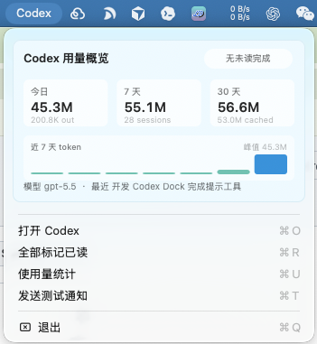

# Codex Dock Notifier

一个 Swift 写的 macOS 小工具，用来监听本机 Codex 会话日志，并在 Codex 完成任务后通过 Dock、状态栏和系统通知提醒你。

## 界面示意



## 功能

- 监听 `~/.codex/sessions` 下的本地 Codex session JSONL 文件。
- 检测到新的 `final_answer` 后发送 macOS 右上角通知。
- 点击通知会打开 Codex，并把线程 ID/session 文件位置复制到剪贴板，方便回到对应任务。
- 让 Dock 图标跳动，并用 Dock badge 显示未读完成数。
- 状态栏图标会随状态变化：空闲、运行中、未读完成会显示不同图标和计数。
- 在状态栏菜单中显示用量缩略图，包括今日、7 天、30 天 token 和近 7 天柱状图。
- 提供完成历史窗口，保留最近 200 次完成记录。
- 支持长任务提醒：Codex session 持续运行超过 10 分钟时会再次提醒。
- 提供完整的使用量统计窗口，包括 daily、7 天、30 天、模型用量、项目用量、session 排行、成本估算、柱状图和折线图。
- 支持导出 Markdown 报告、session CSV 和 daily CSV。
- 支持登录时自动启动。

## 数据来源

工具只读取本机 Codex 数据，不需要网络访问。

主要数据源：

```text
~/.codex/sessions
~/.codex/session_index.jsonl
~/.codex/state_5.sqlite
```

统计逻辑：

- 完成提醒来自 session JSONL 中的 `response_item`，且 `phase` 为 `final_answer`。
- token 用量来自 `event_msg` 中的 `token_count.last_token_usage`。
- 线程名称来自 `session_index.jsonl`。
- 模型名称优先读取 `state_5.sqlite` 中的 `threads.model`，读取不到时回退为 JSONL/provider/`unknown`。
- 运行中任务通过“最新 user/token 事件晚于最新 final answer”推断，并过滤掉 6 小时以上没有活动的旧 session。

## 构建和运行

```bash
make run
```

首次运行时，macOS 会请求通知权限。第一次扫描会把已有 Codex session 作为基线，不会把历史完成记录全部弹出来。

## 使用量统计

状态栏点击 `Codex` 后，可以看到顶部用量缩略图。

点击菜单里的 `使用量统计` 可以打开完整统计窗口，当前包含：

- 总 token
- 估算美元成本
- 今日 token
- 7 天 token
- 30 天 token
- session 数和完成次数
- 按天 token 堆叠柱状图
- 累计 token 折线图
- 模型用量横向柱状图
- 模型切换分析，包括平均 token/session、输出占比和缓存占比
- 项目维度统计，按 session `cwd` 聚合
- session 用量排行表
- 报告导出：Markdown、Session CSV、Daily CSV

成本估算使用 `Sources/CodexDockNotifierCore/UsageCostEstimator.swift` 中的本地价格表，按 input、cached input、output/reasoning token 粗略计算。价格来源参考 [OpenAI API Pricing](https://platform.openai.com/docs/pricing)，实际账单仍以服务商后台为准；如果模型名匹配不到价格表，成本会按 `$0` 处理。

## 完成历史和长任务提醒

点击菜单里的 `完成历史` 可以查看最近 200 次 Codex 完成记录。每条记录会显示：

- 对应线程名或线程 ID
- 完成摘要
- “已验证 / 需处理 / 文件数”等摘要标签
- 相关 session 文件位置

点击历史记录或系统通知里的打开操作时，工具会打开 Codex，并把线程 ID 和 session 文件位置复制到剪贴板。由于 Codex 当前没有公开稳定的线程深链，这里采用本地可用的定位方式。

长任务提醒默认阈值为 10 分钟。同一个 session 的同一轮运行只提醒一次，避免重复打扰。

## 登录时自动启动

安装登录启动项：

```bash
make install-login-item
```

移除登录启动项：

```bash
make uninstall-login-item
```

## 本地状态

工具会记录已经扫描到的位置和已经提醒过的完成事件，避免重复通知。

状态文件位置：

```text
~/Library/Application Support/CodexDockNotifier/state.json
```

状态文件还会保存最近 200 条完成历史。

## 说明

- 这是一个本地工具，不上传 Codex 日志或统计数据。
- 点击 Dock 图标或通知时，会尝试打开 Codex app。
- `.app` 图标由 `Scripts/make-app-icon.swift` 在构建时生成，并打包到 `Contents/Resources/AppIcon.icns`。
